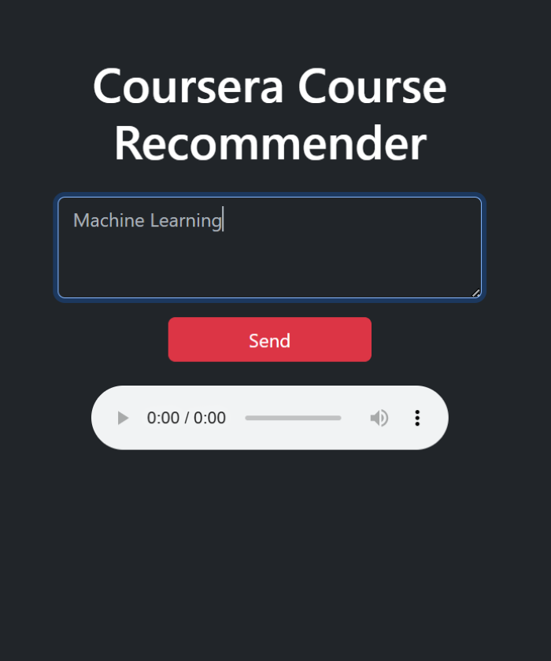
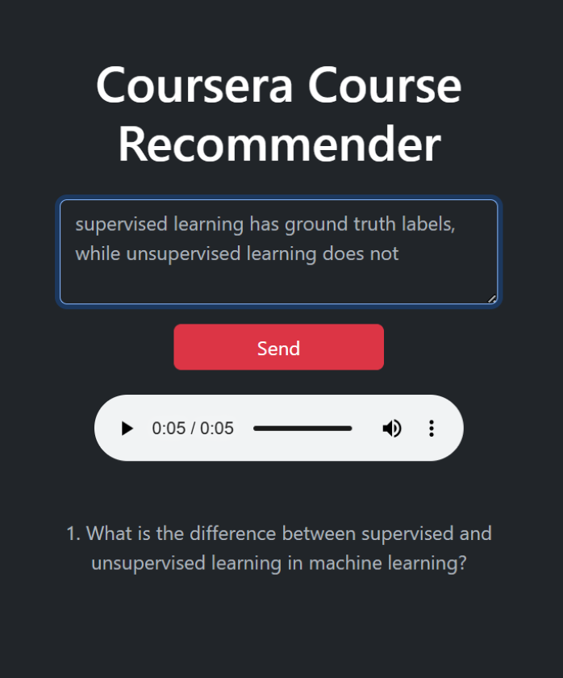
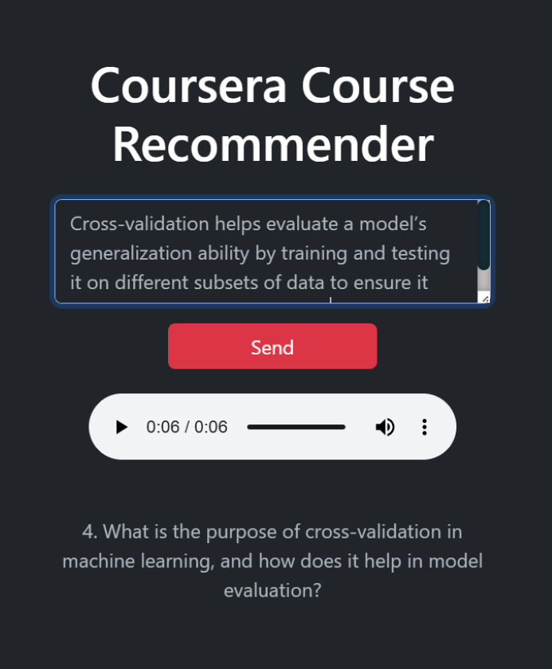

# AI-powered Course Recommender
Enter your interests and answer a few questions to get a course recommendation that suits you best!

Powered by GPT 3.5 and ElevenLabs Voice Technology.

<figure>
    <div style="display: flex; gap: 20px; justify-content: center;">
        
        
        
    </div>
    <figcaption><b>Figure 1.</b> User enters course subject and is asked questions that evaluate user's familiarity with the subject.</figcaption>
</figure>

<figure>
    
    <figcaption><b>Figure 2.</b> Recommended Coursera courses.</figcaption>
</figure>

# To install
1. clone this repository.

2. Create a conda environment for this project.
```
conda create -n CourseRecommender python=3.10
```

3. Install the dependencies in the created environment by
```
cd CourseRecommender
pip install -r requirements.txt
```

4. Set up API keys in the environment variables `OPENAI_API_KEY` and `ELEVENLABS_API_KEY`. 
# To run
Go to the `Main Files` directory and run `python main.py`. This hosts the course recommender web app.
